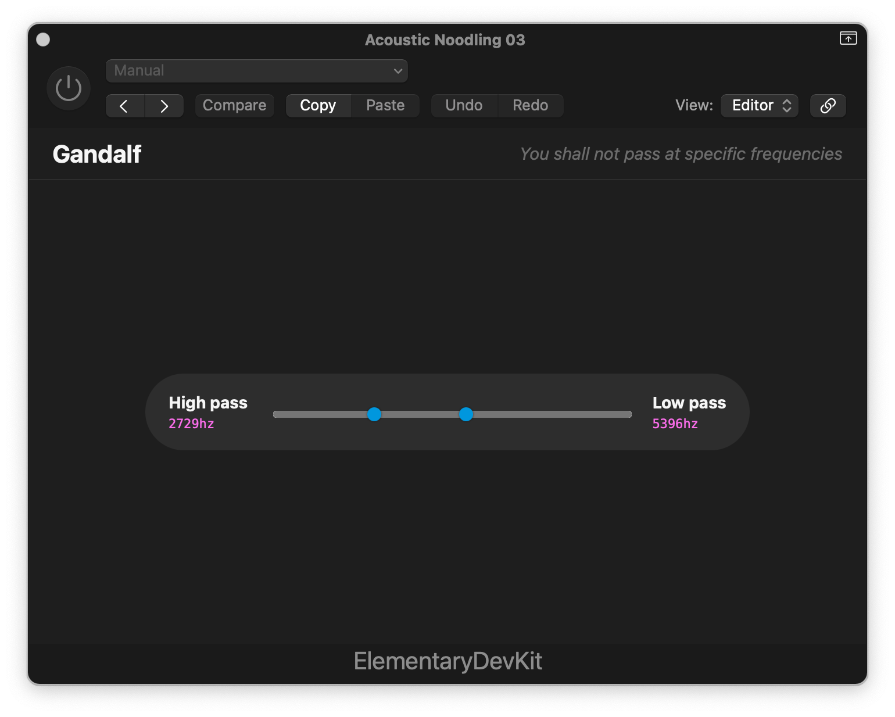

VST with HTML, CSS, and JavaScript using [Elementary Audio](https://www.elementary.audio/).



### Requirements

- You need access to the Elementary Audio host VST, which isn't widley available just yet.
- You need to generate certs for a local secure server. See `script/generate-certs` for details.

```bash
npm install
npm start -- --secure
```
